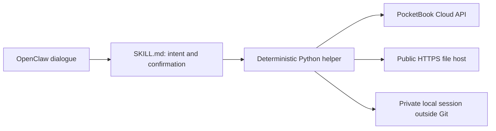

# PocketBook Cloud for OpenClaw

[Русский](README.md) · **English**

[](https://github.com/rommm13/openclaw-pocketbookcloud/actions/workflows/ci.yml)
[](LICENSE)

**An UNOFFICIAL community integration. This project is not affiliated with or endorsed by PocketBook.** PocketBook Cloud and PocketBook applications belong to their respective owners; the consumer API may change without notice.

Manage your PocketBook Cloud library through an OpenClaw conversation: search books, inspect reading progress, upload and download files, prepare chat attachments, read notes and highlights, make backups, and delete books with separate confirmation. Cloud remains the source of truth; the skill does not maintain a second reading catalog.

**Python standard library only. JSON CLI.** The helper needs no pip dependencies, additional server, or database. It also works directly from a terminal.



## Install and sign in

Requirements: Linux / a POSIX-compatible environment, Python 3.11 or 3.12, and a PocketBook Cloud account. OpenClaw provides conversation and chat delivery. Native Windows is not tested; filesystem permission checks expect POSIX semantics.

From the **workspace of your intended OpenClaw agent**:

```bash
mkdir -p skills
git clone https://github.com/rommm13/openclaw-pocketbookcloud.git skills/pocketbook-cloud
cd skills/pocketbook-cloud
python3 scripts/pocketbook.py --help
```

`<workspace>/skills` is a standard [OpenClaw skill location](https://docs.openclaw.ai/tools/skills). Install the entire bundle: `SKILL.md`, `scripts/`, and `references/`. Start a new agent session after installation and check that this skill is selected.

### How authentication works

Authentication follows the same production flow: **PocketBook Cloud email + password**.

```bash
python3 scripts/pocketbook.py doctor
python3 scripts/pocketbook.py auth login
# PocketBook email: user@example.com
# PocketBook password: [hidden input]
```

Email is entered in the terminal and the password is read through hidden `getpass` input. The password is used only for password login and is **never persisted**. After successful sign-in, the helper stores only the local access/refresh session.

The default session path is `~/.config/openclaw/pocketbook-cloud/session.json`: directory mode 0700, file mode 0600. `POCKETBOOK_SESSION_FILE` can select another private path outside Git. Pending-delete and lock files live beside it. Skill upgrades must preserve this external state.

For compatibility with the consumer Cloud API, the helper uses PocketBook browser-client interoperability values. These are technical values publicly shipped by the provider's own web client, **not the user's password and not account tokens**. The repository contains no user credentials, sessions, or Authorization headers.

If an account exposes multiple PocketBook providers, interactive login prompts for the correct one. Existing-session refresh is automatic and does not ask for the password again.

## Examples

Run from the installed skill root and substitute your own paths. Operation results are JSON; interactive login questions are terminal prompts.

```bash
python3 scripts/pocketbook.py books --status reading
python3 scripts/pocketbook.py search "Dune"
python3 scripts/pocketbook.py notes "exact book id"
python3 scripts/pocketbook.py upload "/absolute/path/book.epub"
python3 scripts/pocketbook.py download "exact book id" --output-dir "/tmp/pocketbook-download"
python3 scripts/pocketbook.py download-for-chat "exact book id"
python3 scripts/pocketbook.py backup --output-dir "/absolute/backup/path"
python3 scripts/pocketbook.py auth status
python3 scripts/pocketbook.py auth logout
```

In chat: “What am I reading?”, “Find Dune”, “Upload these attached books”, “Send me this book”, or “Show my highlights”. Ambiguous queries are resolved by author, edition, or id first.

For current OpenClaw attachments, the agent uses `upload-inbound "<MediaPath>"` or `upload-inbound-many "<MediaPath1>" "<MediaPath2>"`. The **newest attachment set** is authoritative. Transferring a book does not require reading its text.

### Multiple books

```bash
python3 scripts/pocketbook.py preflight-upload "/absolute/path/a.epub" "/absolute/path/b.fb2"
python3 scripts/pocketbook.py upload-many "/absolute/path/a.epub" "/absolute/path/b.fb2"
python3 scripts/pocketbook.py preflight-download "id-one" "id-two"
python3 scripts/pocketbook.py download-many "id-one" "id-two" --output-dir "/tmp/pocketbook-download"
```

Before transfer, the agent reports book count and estimated size. `requiresConfirmation: true` requires a separate next user message; only then may the same batch command be repeated with `--confirmed`. Defaults are **more than 10 books or 100 MiB**. Do not add the flag preemptively. For manual `prepare-upload`, the conversation protocol must obtain confirmation before extraction; that command does not independently enforce it.

### Formats, archives, and chat

Primary formats are EPUB, FB2, and FB2.ZIP. PDF, DJVU, TXT, RTF, HTML/HTM, CHM, and CBZ/CBR/CBT are also accepted. Reading and download availability depend on Cloud and the book; DRM/LCP is not bypassed. The helper does not convert formats.

- A real EPUB is already a book container and stays intact. FB2.ZIP remains a native book archive.
- Ordinary transport ZIPs, including filenames ending in `.epub.zip`, are inspected by content. `preflight-upload`, followed by `prepare-upload ... --output-dir ...`, safely extracts supported books; ancillary README/LICENSE files are not counted as books.
- Telegram sometimes transports FB2 as XML. Only a file with a FictionBook root is accepted as FB2 and wrapped in a genuine `.fb2.zip`, with original-byte verification. Ordinary XML is rejected. Never reconstruct an ebook from prompt text.
- `download-for-chat` downloads the original and creates a **genuine outer ZIP**. Use the returned `mediaDirective`; `deliveryPending: true` means the channel must still confirm sending. Renaming an EPUB to `.zip` is not packaging.

Set `OPENCLAW_MEDIA_DIR` outside the repository for delivery files, or run the helper from the agent workspace. Other media roots are considered in order: `OPENCLAW_WORKSPACE_DIR/media`, `OPENCLAW_STATE_DIR/media`, then `./media`. Retain source files and ZIPs until upload/delivery is verified. Direct EPUB uploads smaller than 4 KiB are rejected by the corrupted-file guard.

### Deletion takes two separate messages

After “Delete this book”, the agent runs `delete prepare "id"`, shows the exact book, and **ends the turn**. Only after the next message, such as “delete it”, may it pass that current text verbatim to `delete confirm "delete it"`. An initial “find it and delete it” is not the second confirmation.

The pending request lasts 15 minutes and covers one item in the current account. Account changes, changed id/hash, or expiry abort deletion. `delete cancel` cancels it. Legacy confirmation codes are inert. `accepted_unverified` / `reconcileRequired` calls for a library check; another destructive attempt starts with new preparation. The CLI cannot prove a chat turn boundary: the calling agent must enforce the two-turn protocol.

## Engineering safeguards

| Boundary | Protection |
| --- | --- |
| Book, note, and metadata text | Untrusted data, never agent instructions |
| Paths and ZIPs | Traversal, symlink, absolute-path and name-collision rejection; entry, expansion, and compression limits |
| File URLs | HTTPS and public addresses only; DNS/TLS and each redirect checked; no PocketBook Authorization on file hosts |
| API | Bounded response/error bodies; critical schema validation fails closed on incompatible changes |
| Uploads | Exact `fast_hash`, filename, size, and format verification; HTTP 2xx alone is insufficient |
| Local session | Private permissions, atomic writes, and serialized concurrent refresh |
| Deletion | Next-turn confirmation, account binding, fresh identity checks, pending state consumed before the request |

Backups report `downloaded`, `unavailable`, `failed`, and `complete`; a partial backup is not presented as complete. Existing files are not silently overwritten. See [security](SECURITY.en.md), [architecture](ARCHITECTURE.en.md), and [troubleshooting](references/troubleshooting.md) for details and limits.

## Why this repository exists

This is an inspectable example of a boundary between conversational intent and deterministic integration: the agent resolves intent, Python checks files and state, and the provider confirms the outcome. It demonstrates a separate transport for untrusted URLs, handling of API changes, concurrent session refresh, and uncertain write outcomes. [ARCHITECTURE.en.md](ARCHITECTURE.en.md) explains the modules and tradeoffs.

## Checks and contributions

The current public release passes **131 tests**: 123 production-derived tests plus dedicated public release-boundary regressions. CI never hardcodes the test count. Tests use mocks and synthetic fixtures, without an account or live API.

```bash
python3 -m unittest discover -s tests -v
python3 tools/release_check.py
python3 -m compileall -q scripts tests tools
git diff --check
```

CI runs on Python 3.11 and 3.12. Behavior-changing PRs should preserve safety invariants and include a relevant regression test. Issues should contain only a sanitized reproduction, Python version, and safe error code—not your library, tokens, or signed URLs.

[Public release scope](PUBLIC_RELEASE.md) · [Changelog](CHANGELOG.md) · [MIT No Attribution](LICENSE). `.clawhubignore` excludes tests and development documentation from an install bundle; it does not imply a ClawHub publication.
