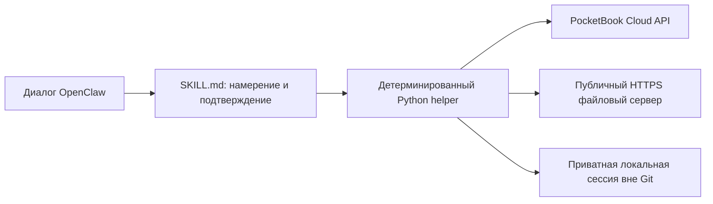

# PocketBook Cloud для OpenClaw

**Русский** · [English](README.en.md)

[](https://github.com/rommm13/openclaw-pocketbookcloud/actions/workflows/ci.yml)
[](LICENSE)

**Неофициальная интеграция сообщества. Проект не связан с PocketBook и не одобрен компанией.** PocketBook Cloud и приложения PocketBook принадлежат их правообладателям; потребительский API может измениться без предупреждения.

Навык позволяет работать с библиотекой PocketBook Cloud через диалог OpenClaw: искать книги, смотреть прогресс чтения, загружать и скачивать файлы, отправлять книги в чат, читать заметки и выделения, создавать резервные копии и удалять книги с отдельным подтверждением. Cloud остаётся источником истины — второй каталог не создаётся.

**Только стандартная библиотека Python. JSON CLI.** Для helper не нужны pip-зависимости, отдельный сервер или база данных. Его можно использовать и напрямую из терминала.



## Установка и первый вход

Нужны Linux / POSIX-совместимая среда, Python 3.11 или 3.12 и учётная запись PocketBook Cloud. OpenClaw требуется для диалога и доставки в чат. Windows нативно не проверяется; проверки файловых прав рассчитаны на POSIX.

Из **рабочего каталога нужного агента OpenClaw**:

```bash
mkdir -p skills
git clone https://github.com/rommm13/openclaw-pocketbookcloud.git skills/pocketbook-cloud
cd skills/pocketbook-cloud
python3 scripts/pocketbook.py --help
```

Каталог `<workspace>/skills` — штатное место установки [навыков OpenClaw](https://docs.openclaw.ai/tools/skills). Устанавливайте весь bundle: `SKILL.md`, `scripts/` и `references/`. После установки начните новую сессию агента; проверьте, что выбран именно этот навык.

### Как проходит авторизация

Авторизация работает так же, как в нашей production-версии: **email + пароль PocketBook Cloud**.

```bash
python3 scripts/pocketbook.py doctor
python3 scripts/pocketbook.py auth login
# PocketBook email: user@example.com
# PocketBook password: [скрытый ввод]
```

Email вводится в терминале, пароль читается скрыто через `getpass`. Пароль используется только для password-login и **никогда не сохраняется**. После успешного входа helper хранит локально только access/refresh session.

По умолчанию сессия находится в `~/.config/openclaw/pocketbook-cloud/session.json`: каталог имеет права 0700, файл — 0600. `POCKETBOOK_SESSION_FILE` позволяет выбрать другой приватный путь вне Git. Pending-delete и lock-файлы размещаются рядом. Обновление skill не должно заменять эти данные.

Для совместимости с consumer Cloud API helper использует client interoperability values браузерного клиента PocketBook. Это публично поставляемые самим web-клиентом технические значения, **не пароль пользователя и не токены аккаунта**. В репозитории нет пользовательских credentials, сессий или Authorization headers.

Если аккаунт возвращает несколько PocketBook providers, интерактивный login предложит выбрать нужный. Refresh существующей сессии выполняется автоматически и не запрашивает пароль повторно.

## Примеры

Из корня установленного навыка; замените примерные пути своими. Результаты операций — JSON, интерактивные вопросы входа — терминальные prompts.

```bash
python3 scripts/pocketbook.py books --status reading
python3 scripts/pocketbook.py search "Дюна"
python3 scripts/pocketbook.py notes "точный id книги"
python3 scripts/pocketbook.py upload "/absolute/path/book.epub"
python3 scripts/pocketbook.py download "точный id книги" --output-dir "/tmp/pocketbook-download"
python3 scripts/pocketbook.py download-for-chat "точный id книги"
python3 scripts/pocketbook.py backup --output-dir "/absolute/backup/path"
python3 scripts/pocketbook.py auth status
python3 scripts/pocketbook.py auth logout
```

В чате: «Что я сейчас читаю?», «Найди Дюну», «Загрузи приложенные книги», «Пришли эту книгу», «Покажи выделения». Неоднозначный запрос сначала уточняется по автору, изданию или id.

Для текущих вложений OpenClaw использует `upload-inbound "<MediaPath>"` или `upload-inbound-many "<MediaPath1>" "<MediaPath2>"`. Берётся **самый новый набор вложений**; книжный текст не нужен для переноса файла.

### Несколько книг

```bash
python3 scripts/pocketbook.py preflight-upload "/absolute/path/a.epub" "/absolute/path/b.fb2"
python3 scripts/pocketbook.py upload-many "/absolute/path/a.epub" "/absolute/path/b.fb2"
python3 scripts/pocketbook.py preflight-download "id-one" "id-two"
python3 scripts/pocketbook.py download-many "id-one" "id-two" --output-dir "/tmp/pocketbook-download"
```

Перед переносом агент сообщает число книг и оценку размера. При `requiresConfirmation: true` нужно отдельное следующее сообщение пользователя; только после него повторяется та же batch-команда с `--confirmed`. По умолчанию порог — **больше 10 книг или 100 MiB**. Не добавляйте флаг заранее. Для ручного `prepare-upload` подтверждение до распаковки обеспечивает диалоговый протокол; это не отдельная проверка внутри этой команды.

### Форматы, архивы и чат

Основные форматы — EPUB, FB2 и FB2.ZIP; также допускаются PDF, DJVU, TXT, RTF, HTML/HTM, CHM, CBZ/CBR/CBT. Возможность чтения и скачивания зависит от Cloud и книги; DRM/LCP не обходятся. Конвертации форматов нет.

- Настоящий EPUB — уже контейнер книги: его не распаковывают. FB2.ZIP остаётся нативным архивом книги.
- Обычный транспортный ZIP, включая имя `.epub.zip`, проверяется по содержимому. `preflight-upload`, затем `prepare-upload ... --output-dir ...` безопасно извлекают поддерживаемые книги; служебные README/LICENSE не считаются книгами.
- Telegram иногда передаёт FB2 как XML. Только файл с FictionBook-root принимается как FB2 и упаковывается в настоящий `.fb2.zip` с проверкой неизменности байтов. Обычный XML отклоняется; книгу нельзя восстанавливать из текста prompt.
- `download-for-chat` скачивает оригинал и создаёт **настоящий внешний ZIP**. Используйте возвращённый `mediaDirective`; `deliveryPending: true` означает, что отправку ещё должен подтвердить канал. Переименование EPUB в `.zip` не заменяет упаковку.

Для файлов доставки задайте `OPENCLAW_MEDIA_DIR` вне репозитория или запускайте helper из рабочего каталога агента. Далее учитываются `OPENCLAW_WORKSPACE_DIR/media`, `OPENCLAW_STATE_DIR/media`, затем `./media`. Исходные файлы и ZIP сохраняйте до подтверждённой загрузки/доставки. Прямая загрузка EPUB меньше 4 KiB блокируется защитой от повреждённых файлов.

### Удаление: два отдельных сообщения

После «Удали эту книгу» агент вызывает `delete prepare "id"`, показывает точную книгу и **заканчивает ход**. Лишь после следующего сообщения, например «удали», он передаёт текущий текст дословно в `delete confirm "удали"`. Первая просьба «найди и удали» не считается вторым подтверждением.

Ожидание действует 15 минут и только для одного элемента текущего аккаунта. Смена аккаунта, id/hash или истечение срока останавливают удаление. `delete cancel` отменяет ожидание. Старые коды подтверждения не работают. При `accepted_unverified` / `reconcileRequired` нужна проверка библиотеки; повторное удаление начинается с новой подготовки. CLI не может доказать границу сообщений — соблюдение двух ходов обязательно для вызывающего агента.

## Что проверяет реализация

| Граница | Защита |
| --- | --- |
| Текст книг, заметок и метаданных | Недоверенные данные, никогда не инструкции агенту |
| Пути и ZIP | Traversal, symlink, абсолютные пути, дубликаты имён, лимиты числа/размера/сжатия |
| Файловые URL | Только HTTPS и публичные адреса, проверка DNS/TLS и каждого redirect; без PocketBook Authorization на файловых хостах |
| API | Ограниченные тела ответов/ошибок; валидация критичных схем с отказом при несовместимости |
| Загрузка | Проверка точного `fast_hash`, имени, размера и формата; HTTP 2xx ещё не успех |
| Локальная сессия | Приватные права, атомарная запись и блокировка конкурентного refresh |
| Удаление | Подтверждение следующего хода, привязка к аккаунту, повторная проверка объекта и потребление pending-state до запроса |

Backup сообщает `downloaded`, `unavailable`, `failed`, `complete`; частичная копия не выдаётся за полную. Существующие файлы не перезаписываются молча. Подробности и ограничения: [безопасность](SECURITY.md), [архитектура](ARCHITECTURE.md), [устранение ошибок](references/troubleshooting.md).

## Зачем существует репозиторий

Это проверяемый пример границы между диалоговым агентом и детерминированной интеграцией: агент выясняет намерение, Python проверяет файлы и состояние, провайдер подтверждает результат. Здесь можно изучить отдельный транспорт для недоверенных URL, отказ при изменении API, конкурентное обновление сессии и обработку неопределённого результата записи. Модули и компромиссы описаны в [ARCHITECTURE.md](ARCHITECTURE.md).

## Проверки и участие

Текущий публичный release проходит **131 тест**: 123 production-derived теста плюс отдельные regression tests публичной release boundary. CI не привязан к числу тестов. Все тесты используют mocks и синтетические fixtures, без аккаунта и live API.

```bash
python3 -m unittest discover -s tests -v
python3 tools/release_check.py
python3 -m compileall -q scripts tests tools
git diff --check
```

CI запускает проверки на Python 3.11 и 3.12. PR с изменением поведения должен сохранять защитные инварианты и добавлять соответствующую регрессию. В issues прикладывайте только обезличенное воспроизведение, версию Python и безопасный код ошибки — без библиотеки, токенов и signed URL.

[Состав публичного релиза](PUBLIC_RELEASE.md) · [Изменения](CHANGELOG.md) · [MIT No Attribution](LICENSE). `.clawhubignore` исключает тесты и документацию разработки из install bundle; это не заявление о публикации в ClawHub.
